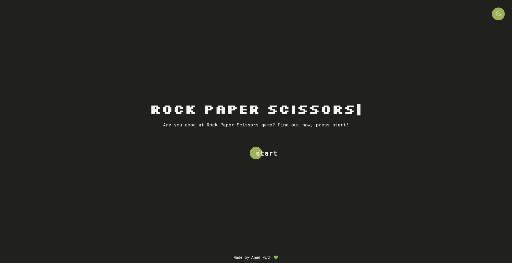

# Rock Paper Scissors Game
A simple **"Rock Paper Scissors"** game from **_"The Odin Project"_** curriculum.

---
## About the Project:
A simple game where the user chooses between three options: rock, paper, or scissors and play with the computer.
* The game have a start page, when clicking on "start", the options appear on the page where user only needs to click on the chosen button option.
* The game has a scoreboard: when the user chooses an option, it shows whether the user or the computer won the round, and then increases the points.
* The first to score 5 points is the winner of the game!
* After announcing the winner, the game asks if the user wants to play again, showing a "play" button.

---
## Features:
* The page has a dark mode button
* It also has animation on the game title and when showing the winner of the game that was implemented with JS and CSS. 
* Was used DOM manipulation, events, functions, conditionals and loop.

---

## Techs and resources used:
The project was developed with: 
* HTML
* CSS
* JavaScript
* Fonts and icons: [GoogleFonts](https://fonts.google.com/)

---
## Visit the project
Check the [project](https://anndcodes.github.io/rock-paper-scissors/) out!

---

Made with ❤️ by [Annd](https://github.com/anndcodes)